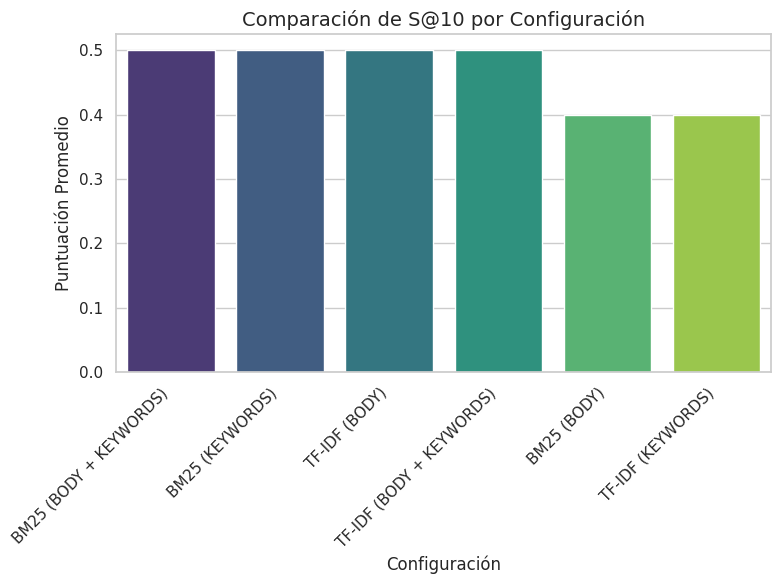
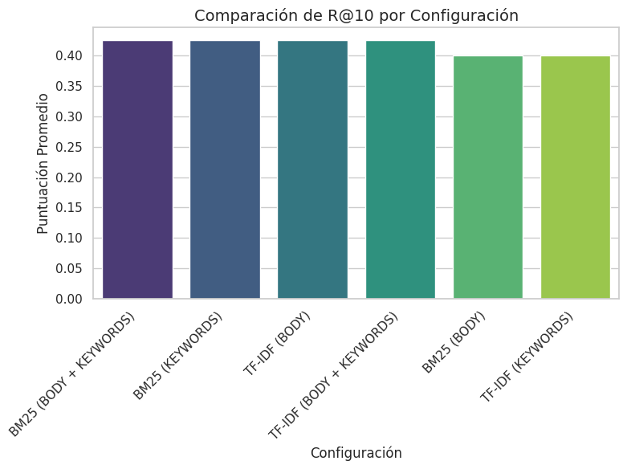
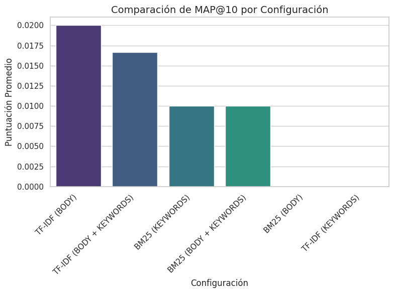
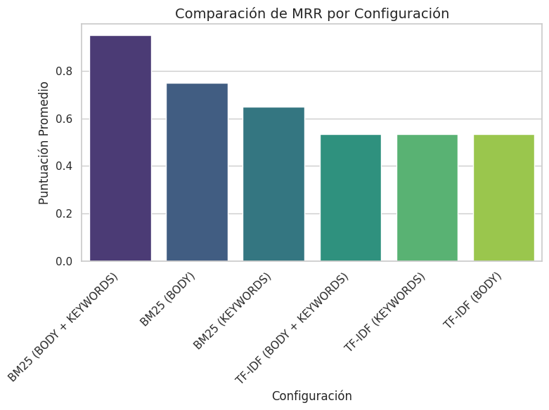
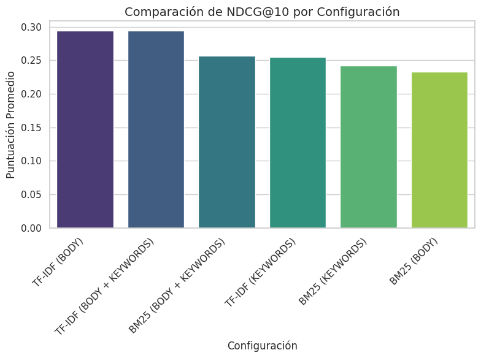

# Comparación de Resultados de Evaluación (TRAIN) - 2025-05-04

Este documento resume los resultados de las métricas obtenidas al evaluar diferentes configuraciones del sistema de recuperación y re-ranking.

## Tabla Comparativa de Métricas Promedio

La siguiente tabla muestra las métricas promedio (@10) para cada configuración probada, ordenada por NDCG@10 descendente.

| Configuración            | Reranker   | Query_Type      |   S@10 |   P@10 |   R@10 |   F1@10 |   MAP@10 |    MRR |   NDCG@10 |
|:-------------------------|:-----------|:----------------|-------:|-------:|-------:|--------:|---------:|-------:|----------:|
| TF-IDF (BODY)            | TF-IDF     | BODY            |    0.5 |   0.09 |  0.425 |  0.143  |   0.02   | 0.5333 |    0.2938 |
| TF-IDF (BODY + KEYWORDS) | TF-IDF     | BODY + KEYWORDS |    0.5 |   0.09 |  0.425 |  0.143  |   0.0167 | 0.5333 |    0.2938 |
| BM25 (BODY + KEYWORDS)   | BM25       | BODY + KEYWORDS |    0.5 |   0.09 |  0.425 |  0.143  |   0.01   | 0.95   |    0.2569 |
| TF-IDF (KEYWORDS)        | TF-IDF     | KEYWORDS        |    0.4 |   0.08 |  0.4   |  0.1287 |   0      | 0.5333 |    0.2544 |
| BM25 (KEYWORDS)          | BM25       | KEYWORDS        |    0.5 |   0.09 |  0.425 |  0.143  |   0.01   | 0.65   |    0.2419 |
| BM25 (BODY)              | BM25       | BODY            |    0.4 |   0.08 |  0.4   |  0.1287 |   0      | 0.75   |    0.2325 |

## Gráficos Comparativos por Métrica

### S@10

### P@10

### R@10

### F1@10

### MAP@10

### MRR

### NDCG@10

*(Nota: Los gráficos asumen que los archivos de imagen están en el mismo directorio que este README)*

## Conclusiones Preliminares

*   **Mejor Configuración (según NDCG@10):** `TF-IDF (BODY + KEYWORDS)` (NDCG@10: 0.2938)
*   **Mejor Configuración (según MAP@10):** `TF-IDF (BODY)` (MAP@10: 0.0200)
*   **Observaciones:** Analiza la tabla y los gráficos individuales para identificar patrones. ¿Algún tipo de reranker (`BM25`, `TF-IDF`) funciona consistentemente mejor para ciertas métricas? ¿Qué tipo de query (`KEYWORDS`, `BODY`, `BODY + KEYWORDS`) es más efectivo en combinación con cada reranker?

*(Recuerda que estos resultados son específicos para el conjunto de datos '{inferred_type_evaluation}' y las configuraciones probadas hasta la fecha)*
